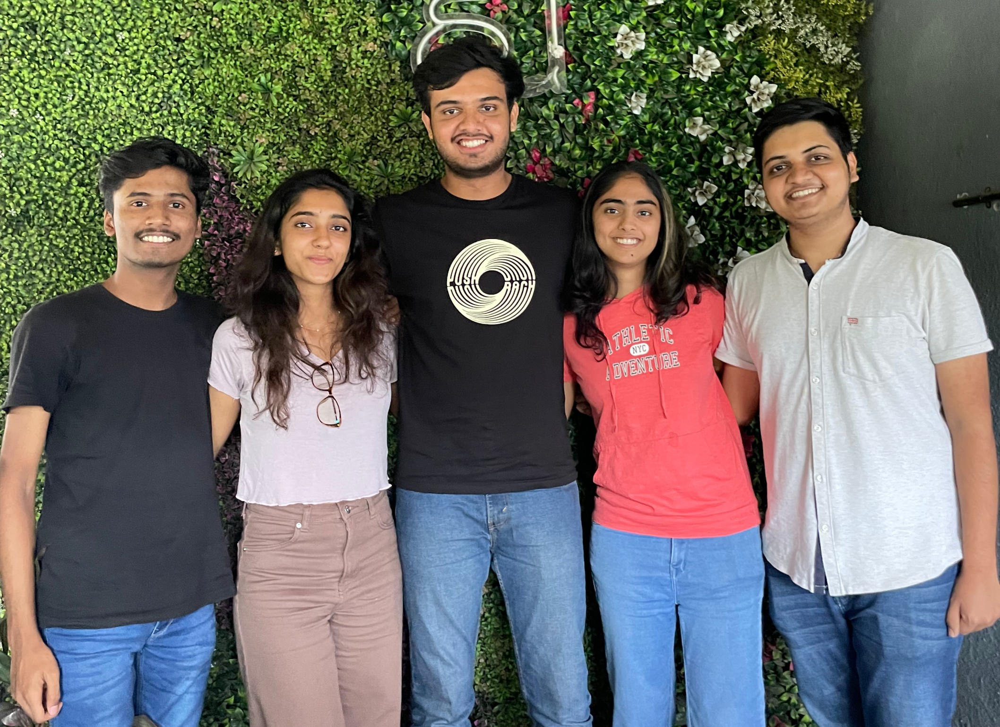

# SmartShed

## Digitalization of the Diesel Loco Shed, Pune

This project is a part of our Internship + Project at the Diesel Loco Shed, Pune. The project is to digitalize the Diesel Loco Shed, Pune. The problem statement is given by the DME of the Diesel Loco Shed, Pune.

## Problem Statement

When a loco comes to the shed, the employees have to fill a form which is a paper form. The form contains the details of the loco and the work to be done on the loco. The form is then sent supervisors and higher authorities for approval. This process is time consuming, requires a lot of paper, prone to errors and can lead to miscommunication. The problem statement is to digitalize this process.

The form should be filled digitally and should be sent to the supervisors and higher authorities for approval. The form should be filled by the employees on a mobile application and should be sent to the supervisors and higher authorities on a web application. The web application should be able to show the status of the form to the employees. The web application should also be able to show the status of the locos in the shed to the employees.

## Solution

We have created a mobile application for the employees and a web application for the supervisors and higher authorities. The application is made using Flutter as the frontend and Express.js as the backend. The database used is MongoDB. As the application is made using Flutter, it can be used on both mobile and web.

## Features

- The employees can fill the form on the mobile application.
- The employees can view the status of the form on the mobile application.
- The supervisors and higher authorities can view the form on the web application.
- The supervisors and higher authorities can approve or reject the form on the web application.
- The supervisors and higher authorities can view the status of the locos in the shed on the web application.

## Team

- [Gopal Saraf](https://github.com/GopalSaraf)
  - Team Leader
  - Flutter Frontend
  - Express.js Backend

